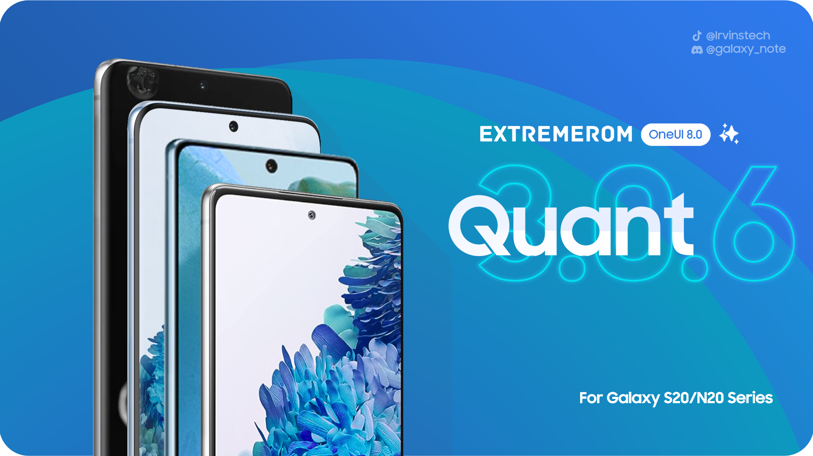

<h1 align="center">
  
</h1>
<p align="center">
  <a href="https://github.com/ArtisanROM/ArtisanROM/blob/sixteen/LICENSE"></a>
  <a href="https://github.com/ArtisanROM/ArtisanROM/commits/sixteen"></a>
  <a href="https://github.com/ArtisanROM/ArtisanROM/stargazers"></a>
  <a href="https://github.com/ArtisanROM/ArtisanROM/graphs/contributors"></a>
</p>
<p align="center">ArtisanROM Quant is a work-in-progress custom firmware for Samsung Galaxy devices.</p>

<p align="center">
  <a  href="https://github.com/ArtisanROM/ArtisanROM/wiki">📖 Wiki</a>
  <a href="https://github.com/ArtisanROM/ArtisanROM/blob/sixteen/CHANGELOG.md">📝 Changelog</a>
  <a href="https://github.com/ArtisanROM/ArtisanROM/blob/sixteen/MAINTAINERS">🧑‍💻 Maintainers</a>
</p>

# What is ArtisanROM Quant?
ArtisanROM Quant is a work-in-progress custom firmware for Samsung Galaxy devices.

It's based on the latest and greatest iteration of Samsung's UX and it also includes additional features and tweaks to ensure the best possible experience out of the box.

It is based on the ExtremeROM and UN1CA build system which allows automatic downloading/extraction of the firmware, applying the required patches and generating a flashable zip package for the specified target device.

ArtisanROM Quant supports devices using the Exynos 990 & Exynos 9820 SoCs

Any form of contribution, suggestions, bug report or feature request for the project will be welcome.

# Features
- Based on the latest stable OneUI 8 Galaxy S25 FE firmware
- All software features from S25 FE
- S25 Ultra CSC, ringtones and more
- Moderately Debloated
- Heavily DeKnoxed
- Full SELinux Support
- Full Galaxy AI support
- Completely upstreamed kernels for all officially supported devices
- Now Brief Support
- Adaptive color tone support
- Super HDR support
- Adaptive Brightness support
- Full CSC support
- Adaptive Refresh Rate support (for some models)
- Multi-User support
- AppLock support
- EroFS partitions
- Stock models in Settings and user apps
- High end animations
- Native/live blur support
- Debloated from useless system services/additional apps
- [BluetoothLibraryPatcher](https://github.com/3arthur6/BluetoothLibraryPatcher) included
- [KnoxPatch](https://github.com/salvogiangri/KnoxPatch) implemented in system frameworks
- Extra mods (Disable Secure Flag, OutDoor mode, more coming soon)
- Extra CSC features (Call recording, Network speed in status bar, 5GHz Hotspot)
- Countless other small optimizations
- More that I can't remember right now and will have to be added in the future

# Bugs
See the <a href="https://github.com/ArtisanROM/ArtisanROM/issues">⚠ Issues</a> tab

# Licensing
This project is licensed under the terms of the [GNU General Public License v3.0](LICENSE). External dependencies might be distributed under a different license, such as:
- [android-tools](https://github.com/nmeum/android-tools), licensed under the [Apache License 2.0](https://github.com/nmeum/android-tools/blob/master/LICENSE)
- [apktool](https://github.com/iBotPeaches/Apktool), licensed under the [Apache License 2.0](https://github.com/iBotPeaches/Apktool/blob/master/LICENSE.md)
- [erofs-utils](https://github.com/sekaiacg/erofs-utils/), dual license ([GPL-2.0](https://github.com/sekaiacg/erofs-utils/blob/dev/LICENSES/GPL-2.0), [Apache-2.0](https://github.com/sekaiacg/erofs-utils/blob/dev/LICENSES/Apache-2.0))
- [img2sdat](https://github.com/xpirt/img2sdat), licensed under the [MIT License](https://github.com/xpirt/img2sdat/blob/master/LICENSE)
- [platform_build](https://android.googlesource.com/platform/build/) (ext4_utils, f2fs_utils, signapk), licensed under the [Apache License 2.0](https://source.android.com/docs/setup/about/licenses)
- [smali](https://github.com/google/smali), [multiple licenses](https://github.com/google/smali/blob/main/third_party/NOTICE)

# Accountability
```cpp
#include <std_disclaimer.h>

/*
* Your warranty is now void.
*
* I am not responsible for bricked devices, dead SD cards,
* thermonuclear war, or you getting fired because the alarm app failed. Please
* do some research if you have any concerns about doing this to your device
* YOU are choosing to make these modifications, and if
* you point the finger at me for messing up your device, I will laugh at you.
*
* I am also not responsible for you getting in trouble for using any of the
* features in this ROM, including but not limited to Call Recording, secure
* flag removal etc.
*/
```

# Credits:
- **[salvogiangri](https://github.com/salvogiangri)** for the UN1CA build system, OneUI patches, and general help and support while developing
- **[ExtremeXT](https://github.com/ExtremeXT)** for helping me fix bugs and giving me support.
- **[GhasemzadehFard-Dev](https://github.com/GhasemzadehFard-Dev)** for helping fix many bugs I was not able to fix.
- **[Mesazane](https://github.com/Mesazane)** for testing and helping with the updaters design, and for updating and fixing KernelSU-Next on the Kernels
- **[ricci205GTI](https://github.com/ricci205GTI)** for fixing motion photo and help with the x1s.
- **[immohammeeed](https://github.com/immohammeeed)** for creating the website for this project.
- **[3q5i](https://github.com/3q5i)** for support and ideas for the ROM
- More that I can't remember right now and will have to be added in the future

## Original ExtremeROM credits:
A big thanks goes to the following for their invaluable contributions in no particular order (MORE INFO AND PEOPLE: TO BE WRITTEN)
- **[salvogiangri](https://github.com/salvogiangri)** for the UN1CA build system, OneUI patches, and general help and support while developing
- **[Ocin4Ever](https://github.com/Ocin4Ever)** for a lot of help especially on smali, advice and emotional support :D
- **[Igor](https://github.com/BotchedRPR)** for getting me into porting, teaching me the basics, and emotional support down the road
- **[Halal Beef](https://github.com/halal-beef)** for lk3rd, testing and misc help
- **[Emad](https://github.com/emadhamid7)** for help with S10-specific fixes
- **[Duhan](https://github.com/duhansysl)** for help with vendor backports, a lot of fixes and advice
- **[Anan](https://github.com/ananjaser1211)** for all of his contributions to OneUI porting
- **[PeterKnecht93](https://github.com/PeterKnecht93)** for help with smali and a lot of misc fixes
- **[tsn](https://github.com/tisenu100)** for some smali fixes and advice
- **[Nguyen Long](https://github.com/LumiPlayground)** for misc fixes and support
- **[AlexFurina](https://github.com/AlexFurina)** for S10 specific fixes
- **[Luphaestus](https://github.com/Luphaestus)** for Note 20 specific fixes
- **[Yagzie](https://github.com/Yagzie)** for engmode and misc fixes
- **[Fred](https://github.com/xfwdrev)** for WFD, HDR10+, audiopolicy and more fixes
- **[Saad](https://github.com/saadelasfur)** for help with build system
- **[Vince](https://github.com/borbelyvince)** for help with kernel upstream
- **Nhat Vo** for Google Telemetry app removal
- **[Code Malaya](https://github.com/jomiejoshiro)** for SPen Air Actions
- **[Renox](https://github.com/renoxtv)** for overlay patches and testing
- **[Ksawlii](https://github.com/Ksawlii)** for updating the build system and FOD animation patch
- **[nalz0](https://github.com/nalz0)** for Multi-User support
- **[EndaDwagon](https://github.com/EndaDwagon)** for the big majority of the ExtremeROM Wiki
- **[Oskar](https://github.com/osrott61-gh)** for Odinpacks, Building before we started using CI, Wiki
- **[Mesazane](https://github.com/Mesazane)** for Building before we started using CI
- **[Dupa](https://github.com/dupazlasu)** for Maintaining S22 Series (ROM + Kernel)
- **[RayShocker](https://github.com/RayShocker)** for HRM fix
- **[Szucsy92](https://github.com/Szucsy92)** for SingleTake fix
- **[Kurt](https://github.com/kurtbahartr)** for ASCII art and some minor fixes
- **@april865** (TG) for ExtremeROM Nexus banner
- And everyone else who aided in testing, wiki, translations etc!

## Original UN1CA credits:
- **[ShaDisNX255](https://github.com/ShaDisNX255)** for his help, time and for his [NcX ROM](https://github.com/ShaDisNX255/NcX_Stock) which inspired this project
- **[DavidArsene](https://github.com/DavidArsene)** for his help and time
- **[paulowesll](https://github.com/paulowesll)** for his help and support
- **[Simon1511](https://github.com/Simon1511)** for his support and some of the device-specific patches
- **[ananjaser1211](https://github.com/ananjaser1211)** for troubleshooting and his time
- **[iDrinkCoffee](https://github.com/iDrinkCoffee-TG)** and **[RisenID](https://github.com/RisenID)** for documentation revisioning
- **[LineageOS Team](https://www.lineageos.org/)** for their original [OTA updater implementation](https://github.com/LineageOS/android_packages_apps_Updater)
- *All the UN1CA project contributors and testers ❤️*

# Kernel sources and device trees
- 990 Kernel Source Code (Maintainer: @Android Artisan): https://github.com/Android-Artisan/android_kernel_samsung_exynos990
- 990 Device Tree Code (Maintainer: @Android Artisan): https://github.com/Android-Artisan/android_device_samsung_exynos990

# Stargazers over time
[](https://starchart.cc/ArtisanROM/ArtisanROM)
